# Optical Flow-based Neural Video Compression

1. [Introduction](#1-introduction)
   1. [Fundamentals](#11-fundamentals)
2. [Codec Architecture](#2-codec-architecture)
   1. [Proposed Architecture](#21-proposed-architecture)
3. [Training breakthrough](#3-training-breakthrough)
   1. [Networks initialization](#31-networks-initialization)
   2. [Joint training](#32-joint-training)
4. [Tests and Results](#4-tests-and-results)


# 1. Introduction

Our project aims to build a *Low-bitrate Lossy Video Codec* that replicates and enhances the conventional video compression architecture. Traditional manually designed codecs rely on motion vectors and residual information to reconstruct non-key frames from previously decoded frames. The reason is that, as will be discussed later, these two pieces of information account for only a small fraction of the original frame size, yet they are sufficient to reconstruct it with high fidelity.

The paper implemented in this project is **[DVC: An End-to-End Deep Video Compression Framework](https://arxiv.org/pdf/1812.00101)** [1]. It represents one of the first neural-network-based approaches to video coding and introduces the general architecture adopted by many subsequent methods. Our goal was to understand this paradigm and extend it by addressing some of the limitations of the original DVC architecture, such as occlusions and the lack of explicit temporal context.

## 1.1 Fundamentals

Let's examine all the main logical components for our codec:

### Optical Flow

Given two consecutive frames, the **Optical Flow** quantifies the motion of objects between them. In simple terms, optical flow describes the direction and magnitude (the speed) of the displacement of each pixel from the first frame to the second. An example: 

<p align="center">
  
</p>

The left image shows motion vectors, where the direction and length of each arrow represent the direction and magnitude of the players displacement. The right image shows the corresponding flow magnitude map, highlighting regions with significant motion while suppressing static background areas.

### Warping operation

Using the optical flow vectors, the first image is warped to match the second image. So the **Warping Operation** consists of shifting each pixel in the first image according to the direction and magnitude given by the flow, effectively predicting where that pixel will be in the next frame.

Aggiungere foto

### Residual

The warping an image based solely on optical flow often introduces artifacts such as occlusions, ghosting effects, and inaccurate motion estimation in complex regions. For this reason, a residual signal is computed to capture the information that cannot be explained by motion compensation alone. In simple terms, the residual error is computed as the difference between the original frame and its warped prediction. 

### PSNR (Peak Signal-to-Noise Ratio)

In image and video compression, reconstruction quality is commonly evaluated using the **Mean Squared Error (MSE)**, which measures the average squared difference between the original and reconstructed images. While MSE is simple and directly optimized during training, its values are often difficult to interpret in terms of perceptual quality.

For this reason, the **PSNR** is widely used. PSNR is a logarithmic transformation of the MSE that expresses reconstruction quality in **decibels (dB)**:

PSNR = 10 · log10(MAX² / MSE)

where `MAX` is the maximum possible pixel value (e.g., 255 for 8-bit images).

Intuitively:
- Lower MSE → Higher PSNR  
- Higher PSNR → Better reconstruction quality

PSNR is commonly adopted in **lossy image and video codecs** because it provides a normalized and interpretable quality metric, enabling fair comparisons across different codecs and bitrates.

Typical PSNR values for 8-bit images and video are:
- **< 25 dB**: poor quality, visible artifacts  
- **25–30 dB**: acceptable quality  
- **30–35 dB**: good quality  
- **> 35 dB**: high quality, differences barely noticeable

### Occlusions


Occlusions occur when parts of the scene become visible or invisible between consecutive frames due to object or camera motion. In these regions, no valid pixel correspondence exists between frames.

This is a problem for motion-based warping, since the warped frame relies on optical flow to map pixels from a previous frame. When occlusions are present, the motion compensation cannot correctly predict these areas, leading to visual artifacts and reconstruction errors. For this reason, occluded regions must be handled separately, typically through residual information or refinement networks.

# 2. Codec Architecture

Almost every video codec follows this paradigm. Starting from a frame $x_t$ at time $t$, the motion with respect to the previous frame $x_{t-1}$ (stored in a buffer) is estimated. The resulting motion field is then compressed, producing the first latent representation $m_t$.

After decoding $m_t$, the decompressed motion is used to warp the previous frame $x_{t-1}$, obtaining a motion-compensated prediction $\bar{x}_t$. The residual error is computed as the difference between the ground-truth frame $x_t$ and the predicted frame $\bar{x}_t$, and subsequently compressed into a second latent representation $y_t$.

Instead of transmitting the full frame $x_t$, only the two latent representations $(m_t, y_t)$ are sent and decoded using the previously reconstructed frame, resulting in a significant reduction in bitrate. The **DVC paper** embrace this approach with the following architecture:

<p align="center">
  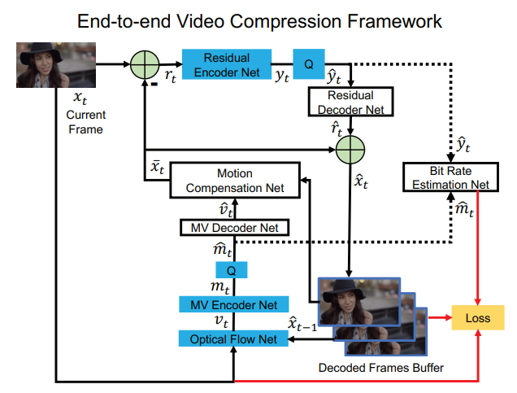
</p>

Here they use five trained neural networks:
 - **Optical Flow NET**: given the two consecutive frames in input, it computes the flow map between them.
 - **MV Encoder NET**: a VAE to compress and reconstruct the flow map.
 - **Motion Compensation NET**: a network that, taken the previous frame and the decompressed flow, outputs a warped prediction.
 - **Residual Encoder NET**: a VAE to compress and reconstruct the residual error.
 - **Bit Rate Estimation NET**: an entropy model that "predict" the bit rate of the VAEs.

## DVC's architecture problems

### No temporal context

As shown in following studies on this topic, such as **[M-LVC: Multiple Frames Prediction for Learned Video Compression](https://arxiv.org/pdf/2004.10290)** [2], temporal context can be a game-changing factor in handling occlusions. Previous reconstructed frames may contain information that is not available in the immediately preceding frame and can be exploited to improve motion compensation and residual prediction, especially in occluded or ambiguous regions.

### Deep-Network to obtain the warped prediction

DVC and several subsequent works rely on a deep neural network that, given the optical flow and the previous reconstructed frame (and in some cases the residual), predicts the current frame. In this setting, the network is required to reconstruct the frame almost from scratch. This approach can easily become a bottleneck during inference. Achieving high reconstruction quality often requires large networks with many parameters, which, combined with the computational cost of optical flow estimation, can significantly reduce compression and decompression speed, resulting in low frames per second (FPS).

# 2.1 Proposed Architecture

Our codec follows the classical motion–residual paradigm, while introducing several modern enhancements. The following image illustrates the overall architecture of the proposed codec:

<p align="center">
  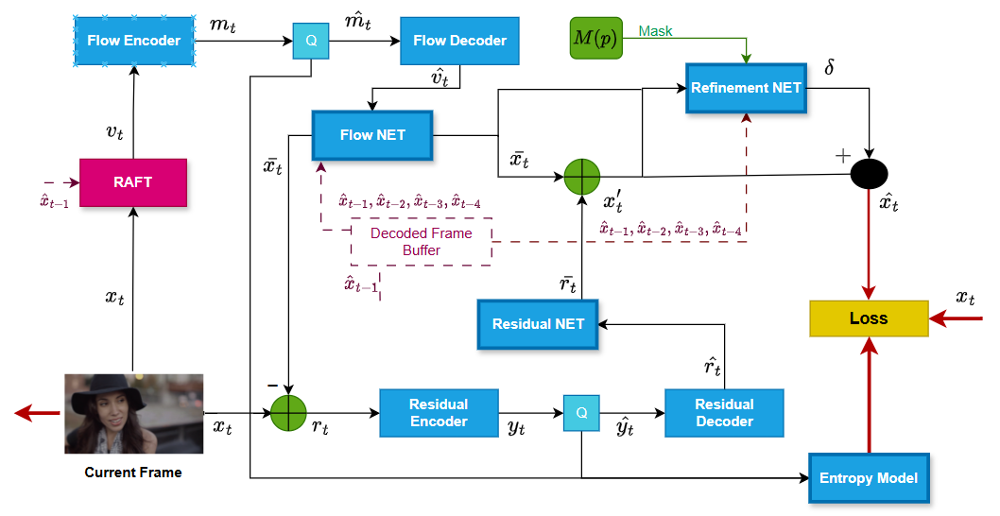
</p>

Instead of a training a motion estimation network (very hard and long to do), we rely on **[RAFT: Recurrent All-Pairs Field Transforms for Optical Flow](https://arxiv.org/pdf/2003.12039)** [4] to compute the optical flow. We adopt the small configuration of RAFT, which provides state-of-the-art optical flow accuracy with a lightweight model, enabling faster inference and training.

Let's examine all the architecture components in detail:

## 4-Frame History Buffer

The last four reconstructed frames are stored in a buffer and used as temporal context for the refinement networks.

The key idea is that the information needed to correctly reconstruct a region in the current frame is not always present in the immediately previous frame $x_{t-1}$. Due to motion and occlusions, parts of the scene may disappear and reappear across multiple frames [2].

Using a 4-frame buffer allows the model to:
- recover details that were visible in earlier frames but are occluded in $x_{t-1}$
- improve motion refinement by observing longer temporal patterns
- reduce ambiguity in regions where optical flow is unreliable

This is particularly effective for handling **occlusions**, where the warped prediction alone is insufficient.

Limiting the buffer to four frames provides a good trade-off between richer temporal context and computational efficiency. A larger history would increase complexity with diminishing benefits, while a single frame would not provide enough information to resolve complex motion scenarios.

## Flow and Residual Encoder-Decoder VAEs 

The autoencoder architecture we've chosen is the one proposed in **[Variational Image Compression with a Scale Hyperprior](https://arxiv.org/pdf/1802.01436)** [3], and it is used to compress both the optical flow and the residual error.

In our setting, the decoder does not need to reconstruct an image from scratch, since it already relies on a strong prior given by the previously reconstructed frame $x_{t-1}$. This makes the hyperprior architecture particularly suitable: it is designed to preserve structural information while achieving high compression efficiency by modeling the spatial dependencies of the latent representation.

As highlighted in the original paper, the scale hyperprior allows a more accurate entropy model of the latent features, resulting in better rate–distortion performance. This property is especially beneficial in our case, where the information to be encoded (flow and residual) is already structured and correlated with the reference frame.

The implementation is based on the Scale Hyperprior model provided by [CompressAI - Model Documentation](https://interdigitalinc.github.io/CompressAI/models.html):


```python
class ScaleHyperprior(CompressionModel):
    def __init__(self, N, M, in_channels=2, out_channels=2, **kwargs):
        super().__init__(**kwargs)

        self.entropy_bottleneck = EntropyBottleneck(N)

        # Analysis transform
        self.g_a = nn.Sequential(
            conv(in_channels, N),
            GDN(N),
            conv(N, N),
            GDN(N),
            conv(N, N),
            GDN(N),
            conv(N, M),
        )

        # Synthesis transform
        self.g_s = nn.Sequential(
            deconv(M, N),
            GDN(N, inverse=True),
            deconv(N, N),
            GDN(N, inverse=True),
            deconv(N, N),
            GDN(N, inverse=True),
            deconv(N, out_channels),
        )

        # Hyperprior analysis
        self.h_a = nn.Sequential(
            conv(M, N, stride=1, kernel_size=3),
            nn.ReLU(inplace=True),
            conv(N, N),
            nn.ReLU(inplace=True),
            conv(N, N),
        )

        # Hyperprior synthesis
        self.h_s = nn.Sequential(
            deconv(N, N),
            nn.ReLU(inplace=True),
            deconv(N, N),
            nn.ReLU(inplace=True),
            conv(N, M, stride=1, kernel_size=3),
            nn.ReLU(inplace=True),
        )

        self.gaussian_conditional = GaussianConditional(None)
        self.N = int(N)
        self.M = int(M)

    @property
    def downsampling_factor(self) -> int:
        return 2 ** 4

    def forward(self, x):
        y = self.g_a(x)
        z = self.h_a(torch.abs(y))
        z_hat, z_likelihoods = self.entropy_bottleneck(z)
        scales_hat = self.h_s(z_hat)
        y_hat, y_likelihoods = self.gaussian_conditional(y, scales_hat)
        x_hat = self.g_s(y_hat)

        return {
            "x_hat": x_hat,
            "likelihoods": {"y": y_likelihoods, "z": z_likelihoods},
        }

    @classmethod
    def from_state_dict(cls, state_dict):
        N = state_dict["g_a.0.weight"].size(0)
        M = state_dict["g_a.6.weight"].size(0)
        in_channels = state_dict["g_a.0.weight"].size(1)
        out_channels = state_dict["g_s.6.weight"].size(0)

        net = cls(N, M, in_channels=in_channels, out_channels=out_channels)
        net.load_state_dict(state_dict)
        return net

    def compress(self, x):
        y = self.g_a(x)
        z = self.h_a(torch.abs(y))

        z_strings = self.entropy_bottleneck.compress(z)
        z_hat = self.entropy_bottleneck.decompress(z_strings, z.size()[-2:])

        scales_hat = self.h_s(z_hat)
        indexes = self.gaussian_conditional.build_indexes(scales_hat)
        y_strings = self.gaussian_conditional.compress(y, indexes)

        return {"strings": [y_strings, z_strings], "shape": z.size()[-2:]}

    def decompress(self, strings, shape):
        assert isinstance(strings, list) and len(strings) == 2

        z_hat = self.entropy_bottleneck.decompress(strings[1], shape)
        scales_hat = self.h_s(z_hat)
        indexes = self.gaussian_conditional.build_indexes(scales_hat)
        y_hat = self.gaussian_conditional.decompress(strings[0], indexes, z_hat.dtype)

        x_hat = self.g_s(y_hat)
        return {"x_hat": x_hat}
```

We slightly modified the original Scale Hyperprior implementation by feeding the absolute value of the latent representation to the hyperprior network (`z = h_a(|y|)`). 

This encourages the hyperprior to model the magnitude (scale) of the features rather than their sign, which is particularly suitable for optical flow and residual representations where the direction information is preserved in the main latent branch.

Additionally, the architecture was extended with configurable `in_channels` and `out_channels` parameters, since the model is used to compress both optical flow (2 channels) and residual error (3 channels). This makes the same Scale Hyperprior backbone adaptable to different types of inputs without altering its core structure.

## Post-proceessing NETs

Like **DVC** and other studies we use two post processing nets to refine both *Optical Flow* and *Residual*. The goal of the **_Flow Refine NET_** is to minimize the difference between the warped prediction and the ground-truth frame. The smaller this error is, the less information the residual needs to encode, directly reducing the number of bits required for its compression. The **_Residual Refine NET_** is a lightweight network made to denoise the decompressed residual before the final reconstruction. 

As discussed before, one limitation of several video codecs is the reliance on large CNNs designed to reconstruct the frame, the flow, or the residual almost entirely from scratch. In our architecture, we instead adopt two lightweight ResNet-based backbones.

ResNets are particularly suitable in this context because they are designed to learn residual corrections over an existing input rather than rebuilding the signal from the ground up. Thanks to their identity-mapping property, they provide stable refinements starting from a strong prior (the decompressed flow and residual), making them both efficient and well-suited for this task.

### Flow Refine NET

The `MotionRefineNET` refines the **decompressed optical flow** by predicting a small correction term.  
It takes as input the current flow estimate `flow_hat` (2 channels) concatenated with a **temporal context** of the last 4 reconstructed frames (like its done in **M-LVC**), for a total of 14 input channels.

The network is a lightweight ResNet-style model:
- a small convolutional **stem** to extract features
- a stack of residual blocks (with larger dilation in the last blocks to enlarge the receptive field)
- a `delta_head` that predicts a **flow residual** `delta` (2 channels)

Finally, the refined flow is obtained as:
`flow_refined = flow_hat + delta`
meaning the model learns **small, stable updates** instead of reconstructing flow from scratch.

```python
class MotionRefineNET(nn.Module):
    def __init__(self, base=64, blocks=8, use_gn=True, use_gate=True):
        super().__init__()

        # Input: 2 (Flow) + 12 (History: t-1, t-2, t-3, t-4) = 14 channels
        in_ch = 14

        self.stem = nn.Sequential(
            nn.Conv2d(in_ch, base, 3, padding=1),
            nn.ReLU(inplace=True)
        )

        body = []
        for i in range(blocks):
            dil = 1 if i < blocks - 2 else 2
            body.append(ResBlock(base, dilation=dil, use_gn=use_gn))

        self.body = nn.Sequential(*body)

        # Predict a correction (delta) for the flow
        self.delta_head = nn.Conv2d(base, 2, 3, padding=1)
        nn.init.zeros_(self.delta_head.weight)
        nn.init.zeros_(self.delta_head.bias)

        self.use_gate = use_gate
        if use_gate:
            self.gate_head = nn.Conv2d(base, 1, 3, padding=1)
            nn.init.zeros_(self.gate_head.weight)
            nn.init.zeros_(self.gate_head.bias)

    def forward(self, flow_hat, history_4f):
        x = torch.cat([flow_hat, history_4f], dim=1)

        f = self.stem(x)
        f = self.body(f)

        delta = self.delta_head(f)

        if self.use_gate:
            gate = torch.sigmoid(self.gate_head(f))
            delta = gate * delta

        return flow_hat + delta
```

Group Normalization is used for training stability with small batch sizes (more in details in the training chapter), while the gating mechanism allows the network to apply corrections selectively only in regions where the motion estimation is unreliable.

### Residual Refine NET

The `ResRefiNET` refines the **decompressed residual** by predicting a small correction over it.

The network is a lightweight ResNet-style model:
- a convolutional **head** to extract features,
- a stack of residual blocks for stable feature processing,
- a **tail** convolution that predicts a correction term.

The final output is obtained as:

`residual_refined = residual_hat + correction`

Thanks to the zero-initialization of the last layer, the network starts by behaving like an identity function and gradually learns only the necessary adjustments. This makes the refinement stable and well-suited for residual signals, where only small corrections are required rather than full reconstruction.

```python
class ResRefiNET(nn.Module):
    def __init__(self, in_channels=3, mid_channels=64, num_blocks=6):
        super().__init__()

        self.head = nn.Conv2d(in_channels, mid_channels, kernel_size=3, padding=1)

        self.body = nn.Sequential(
            *[ResBlock(mid_channels, use_gn=True) for _ in range(num_blocks)]
        )

        self.tail = nn.Conv2d(mid_channels, in_channels, kernel_size=3, padding=1)

        # Initialize to learn small corrections
        nn.init.zeros_(self.tail.weight)
        nn.init.zeros_(self.tail.bias)

    def forward(self, x):
        identity = x
        out = self.head(x)
        out = self.body(out)
        correction = self.tail(out)
        return identity + correction
```

### ResRefineNet Test Performance

This lightweight module plays a critical role in the pipeline. Acting as a learned loop filter, it cleans up quantization artifacts without requiring additional bitrate.
In our validation phase, enabling this module resulted in a massive quality boost:

| Metric | Base Reconstruction | With ResRefineNET | **Net Gain** |
| :--- | :--- | :--- | :--- |
| **PSNR** | 34.01 dB | **35.68 dB** | **+1.67 dB**  |
| **SSIM** | 0.9196 | **0.9406** | **+0.021** |

This confirms that post-processing the residual is far more efficient than trying to encode high-frequency noise directly in the VAE latent space.

## Final Refinement Net

The final network is responsible for producing the last correction applied to the reconstructed frame (warp + residual).

It takes as input:
- the 4-frame history
- the warped frame
- the reconstructed frame
- an adaptive mask $M(p)$, where $p$ denotes the residual error magnitude

Again, the goal of this network is not to reconstruct the frame from scratch, but to apply targeted corrections only where the reconstruction is still inaccurate.

---

#### Adaptive Mask Definition

The mask is defined as:

$$
M(p) = \tanh\left( \lambda \cdot \frac{\|\|\bar{r}_t(p)\|\|_2}{\mu_t + \epsilon} \right)
$$

where

$$
\mu_t = \frac{1}{H \cdot W} \sum_{p} \|\|\bar{r}_t(p)\|\|_2
$$

$$
\epsilon = 10^{-6}, \quad \lambda \in [0.5, 2.0]
$$

implemented as:

```python
def compute_adaptive_mask(residual, lambda_param=1.5, epsilon=1e-6):
    norm_per_pixel = torch.sqrt(torch.sum(residual ** 2, dim=1, keepdim=True))
    H, W = residual.shape[2], residual.shape[3]
    mu = torch.sum(norm_per_pixel, dim=(2, 3), keepdim=True) / (H * W)
    mask = torch.tanh(lambda_param * norm_per_pixel / (mu + epsilon))
    return mask
```

#### Interpretation

For each pixel, the residual magnitude is normalized by the **mean residual error of the frame** and passed through a `tanh` function, producing values in the range $[0, 1]$:

- values close to **0** correspond to well-predicted regions,
- values close to **1** correspond to areas with high reconstruction error.

This adaptive mask allows the final refinement network to focus its corrections primarily on problematic regions (e.g., occlusions, motion inaccuracies, or complex textures), while leaving already well-reconstructed areas mostly untouched.

The parameters $\lambda$ and $\epsilon$ control the behavior and stability of the adaptive mask:

- **$\lambda$** scales the sensitivity of the mask. Higher values make the mask react more strongly to residual differences, highlighting high-error regions more aggressively. Lower values produce a smoother, less selective mask.

- **$\epsilon$** is a small constant added for numerical stability. It prevents division by very small values of $\mu_t$ when the average residual in the frame is close to zero.

---

The architecture follows a lightweght encoder–residual–decoder model:
- an **encoder** extracts initial features from the concatenated inputs
- a stack of residual blocks processes the features stably
- a **decoder** predicts a small correction term

The correction is applied selectively using the adaptive mask:

`refined = recon + correction × mask`

Normally, before this network is applied, the frame reconstruction is already of good quality. This model ensures that the network focuses its effort only on regions where the reconstruction error is high (e.g., occlusions or motion artifacts), while leaving well-reconstructed areas mostly unchanged. 

Thanks to the temporal context provided by the previous reconstructed frames, this network is particularly effective at handling occlusions. As said before, information that is missing in the current warped prediction may still be present in earlier frames, allowing the model to recover details that cannot be inferred from the immediate frame pair alone.

The encoder–decoder architecture is well suited for this task: the encoder aggregates information from multiple inputs into a compact feature representation, while the decoder translates these features into a precise correction. This structure allows the network to reason globally while applying localized refinements.

```python
class AdaptiveRefiNET(nn.Module):
    def __init__(self, base=64, num_blocks=10):
        super().__init__()

        # Input: recon (3) + warped (3) + mask (1) + history (12) = 19 channels
        self.encoder = nn.Sequential(
            nn.Conv2d(19, base, 3, 1, 1),
            nn.LeakyReLU(0.2, inplace=True),
            nn.Conv2d(base, base, 3, 1, 1),
            nn.LeakyReLU(0.2, inplace=True)
        )

        self.res_blocks = nn.ModuleList([
            SimpleResBlock(base) for _ in range(num_blocks)
        ])

        self.decoder = nn.Sequential(
            nn.Conv2d(base, base, 3, 1, 1),
            nn.LeakyReLU(0.2, inplace=True),
            nn.Conv2d(base, 3, 3, 1, 1)
        )

    def forward(self, recon, warped, mask, history):
        x = torch.cat([recon, warped, mask, history], dim=1)

        feat = self.encoder(x)

        for block in self.res_blocks:
            feat = block(feat)

        correction = self.decoder(feat)
        refined = recon + correction * mask

        return refined.clamp(0, 1)
```

---

# 3. Training breakthrough


The training of the full codec is a multi-stage process. As done in **DVC** and **M-LVC**, it consists of two necessary phases:

1. **Network Initialization**  
   Each component is first trained independently to initialize the weights and learn its specific sub-task (flow refinement, residual compression, residual refinement, etc.).

2. **Joint Training**  
   All networks are then fine-tuned together end-to-end to optimize the overall rate–distortion performance of the codec, allowing the components to adapt to each other and work as a coherent system.

Before detailing the training process, the following *loss functions* must be introduced.

### Rate–Distortion Loss

The Rate–Distortion (RD) loss is the core objective used to train the compression networks. It balances two competing goals:

- minimizing the bitrate required to encode the latent representations,
- minimizing the reconstruction error between the original and reconstructed frames.

It is typically defined as:

L = R + λ · D

where:
- **R** is the estimated bitrate obtained from the likelihoods of the latents,
- **D** is the distortion term (usually MSE or MS-SSIM),
- **λ** controls the trade-off between compression efficiency and reconstruction quality.

A higher λ prioritizes quality, while a lower λ favors stronger compression.

---

### MS-SSIM

MS-SSIM (Multi-Scale Structural Similarity) is a perceptual metric that measures image similarity by comparing structures, luminance, and contrast at multiple scales.

Unlike MSE, which measures pixel-wise differences, MS-SSIM correlates better with human visual perception. For this reason, it is often used as the distortion term in lossy image and video compression.

Using MS-SSIM encourages the model to preserve structural and perceptual details rather than focusing only on minimizing numerical pixel error.

# 3.1 Networks initialization

For each network, we describe the training process, provide a link to the corresponding code, and show the visual effect of the module.

We begin by introducing the datasets used:

## Vimeo90k Triplets and Septuplets 

We use the Vimeo90k dataset, available at: http://toflow.csail.mit.edu/

This dataset is particularly well suited for learned video compression because it provides short, high-quality frame sequences with moderate motion, limited camera shake, and consistent scene content. These characteristics make it ideal for training models based on motion estimation, warping, and residual prediction.

Two specific subsets are used:

- Triplets: sequences of three consecutive frames.
These are used for training components that require only a single temporal reference, such as optical flow and residual compression.

- Septuplets: sequences of seven consecutive frames.
These are used whenever extended temporal context is required, especially for the refinement networks that exploit the 4-frame history buffer. The additional frames allow the model to learn how to recover information across occlusions and complex motion patterns.

The structure of Vimeo90k provides clean temporal continuity while keeping sequences short enough to allow efficient training and rapid experimentation.

## Optical Flow VAE training

The first model trained is the  **_Motion VAE_**. This network is responsible for compressing and decompressing the optical flow produced by RAFT.

The primary goal of this stage is to maintain a good reconstruction quality of the flow. If the compression is too aggressive, the warped prediction will be inaccurate, directly increasing the residual error. As a consequence, more bits will be required to encode the residual, defeating the purpose of the compression. In the other end the latent must still to be competitive regards the other studies. So we are searching for a sweet spot between bit optimal compression and quality of the flow (mostly on borders). 

The hyperparameters to be chosen during training are:
- `Lambda` of the rate distortion loss (quality - bitrate tradeoff)
- The VAE's number of feature and hyperprior channels
- The `max_flow` value, it represents the maximum displacement (in pixels) that the model is designed to handle and compress.

During the training process this last one was the most critical: Choosing the correct value involves a trade-off between dynamic range and precision:
- If `max_flow` is too LOW (e.g., 10.0): Pros: Provides high precision for small, subtle movements. Cons: Fast motion exceeds the limit and gets clipped (saturated). The network fails to perceive the true magnitude of the motion, leading to reconstruction artifacts such as ghosting or stuttering in high-speed scenes.
- If `max_flow` is too HIGH (e.g., 200.0): Pros: Capable of capturing extremely fast motion without clipping. Cons: Common, smaller movements are mapped to tiny numerical values (e.g., $5 / 500 = 0.01$). This leads to quantization errors and numerical instability, making it difficult for the network to learn fine motion details.

In our first experiment the `max_flow` value was set to 20.0 following studies approaches; what we saw during inferences and tests was that for Vimeo's frames it was perfect, but for real video compression with camera motion and bigger movements was a disaster! The clipping was cutting a lot of motion causing a critical residual error -> high bitrate compression.

So for our final training configuration we designed a three stage training:

### First stage 

To initialize the weights of the net we set a `max_flow` of 50.0 allowing the model to learn a sufficiently wide range of motion during the early training phase. Following the strategy adopted in DVC, the value of $\lambda$ in the rate–distortion loss was progressively increased from 256 up to 1024. In the original DVC work, the final value reaches 2048, prioritizing reconstruction quality over bitrate. 

In our case, we intentionally stop at 1024 to favor lower bitrate compression. This choice is motivated by the fact that the flow will later be refined by the subsequent post-processing network, which compensates for the slightly more aggressive compression applied at this stage.

The VAE's feature and hyperprior channels are set to 192 following **M-LVC**.

**Training Code:**  [Kaggle Notebook - Motion Vae Stage 1](https://www.kaggle.com/code/lucabrunetti/motion-vae-stage-1)

The first stage trained for 15 epochs on Kaggle's P100 GPU ( circa 14h ). Here the goal was to minimize the rate distortion loss on reconstructing the flow on two consecutive frames (Vimeo90k Triplets).

### Second stage 

In the second stage, the `max_flow` is increased to 100, and the optical flow to be reconstructed is computed between frames separated by a gap of two time steps. This introduces larger motion patterns, allowing the network to learn how to handle more challenging displacements and improving its generalization to higher-motion scenarios.

**Training Code:**  [Kaggle Notebook - Motion Vae Stage 2](https://www.kaggle.com/code/lucabrunetti/motion-vae-stage-2)

The second stage trained for 15 epochs on Kaggle's P100 GPU ( circa 14h ).

### Last stage

In the last stage the `max_flow` is still set to 100 but the flow is computed on a four time step gap.

This stage was done on the Septuplet Dataset and trained for 20 epochs on a RTX 4090 (circa 10h, Septuplet dataset is significally bigger then the triplets subset). The needs to a GPU ugrade was mainly a VRAM and batch size bottlenck with the kaggles's one ( with the septuplets the P100 can only handle a 4 batch size). 

---

In the end the process took 38h of training to be completed, an example of a reconstruction with the fully trained net of a motion vector:

<p align="center">
  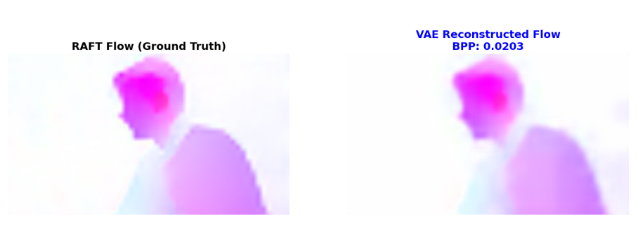<br>
  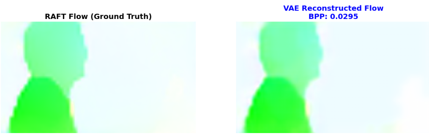<br>
  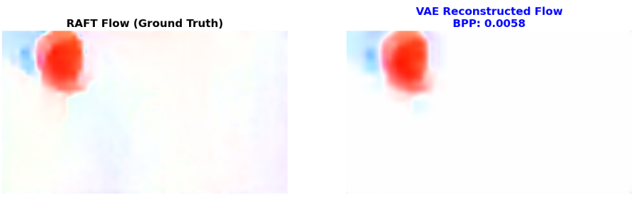
</p>

The latent is compressed more than 880x from the flow at32 RAFT's output sti mantaining good quality. Full tests file can be found in the tests directory as `flow_comparison.zip`

## Motion Refinement NET

The network to postprocess the decompressed flow was trained to minimize the warped frame MSE w.r.t the groundtruth frame. Training was done for 20 epochs between kaggle's P100 and the RTX 4090 (circa 18h). The dataset used was the Septuplets in order to give the

**Training Code:**  [Kaggle Notebook - Motion Refinement Net](https://www.kaggle.com/code/lucabrunetti2/motion-post-processing-net)

Below an example of the output of the network. As can be seen below, the refined flow, thanks to the temporal context, is able to better capture the motion patterns of the scene, producing a more coherent and accurate motion field compared to the initial decompressed flow.

<p align="center">
  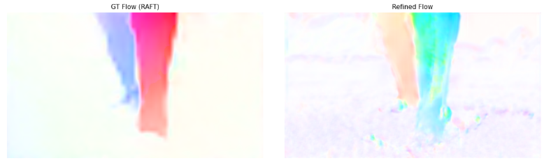<br>
  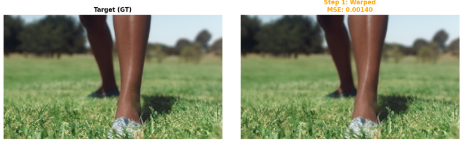
</p>

It is easy to notice that the warped frame alone is not sufficient for an optimal reconstruction. Visible ghosting artifacts can be observed, especially around the moving leg. This is precisely why the residual error is necessary.

The warped reconstruction achieves a PSNR of 28.54 dB, while reconstruction quality is generally considered acceptable from 30 dB and above.

## Residual VAE training

The training of the Residual VAE focuses on compressing the error between the original frame and the warped prediction. This is the most critical component for achieving high fidelity.

We initially validated the architecture on a reduced subset of the Vimeo-90k dataset Septuplets (approx. 9GB vs the full 88GB) to ensure rapid iteration and verify training stability. Training was done for 10 epochs on kaggle's P100.

To prevent the network from learning trivial identity mappings, we adopted a **"Hard Mode" Training Strategy**. Instead of computing the residual between consecutive frames ($t$ and $t+1$), we compute it with a temporal gap of **2 frames** ($t$ and $t+2$).

This forces the Residual VAE to work harder, learning to encode complex structures and occlusion errors efficiently. The model showed **rapid convergence**, reaching a performance plateau after just 5 epochs.

**Results:**
This strategy proved highly effective. On the Vimeo-90k test set, the module achieved:
- **Bitrate:** ~0.29 BPP (Outperforming the DVC baseline)
- **Quality:** ~36.0 dB PSNR (High Fidelity)

**Training Code:** [Kaggle Notebook - Residual VAE Hard Mode](https://www.kaggle.com/code/danielebracoloni/residualvae-hard-mode-training)


## Residual Refinement NET (Post-Processing)

The next component of our pipeline is the **Residual Refinement Network (`PostProcessNet`)**.
While the Residual VAE is efficient at encoding the structural error, the quantization process in the latent space inevitably introduces high-frequency noise and reconstruction artifacts (such as ringing or blocking effects).

### Training Strategy
We trained this network to act as a **Learned Loop Filter** (similar to the Deblocking Filter in H.264/HEVC), but powered by a CNN.
- **Input:** The "noisy" reconstruction obtained from the frozen VAEs (Warped Frame + Decoded Residual).
- **Target:** The original Ground-Truth frame.

This forces the network to specialize in **denoising** and artifact removal, learning to correct specific systematic errors introduced by the compression stages without altering the bitrate.

###  Results & Performance Gain

The impact of this module was significant. On our validation set, enabling the Post-Process NET resulted in a massive quality boost:

| Metric | Base Reconstruction | With Post-Process | **Net Gain** |
| :--- | :--- | :--- | :--- |
| **PSNR** | 34.01 dB | **35.68 dB** | **+1.67 dB**  |
| **SSIM** | 0.9196 | **0.9406** | **+0.021** |

Visually, the network successfully smooths out quantization noise while preserving edge sharpness, resulting in a much cleaner final image.

### Drift Analysis (Long-Term Stability)
A critical challenge in video compression is **Error Propagation (Drift)**. If the codec makes a small error in frame $t$, that error is warped and amplified in frame $t+1$.

We performed an **Autoregressive Test on 100 consecutive frames** (using the model's own output as input for the next step).
The results show that our architecture is **drift-resistant**:
- The quality remains stable around **37.5 dB** throughout the sequence.
- The Refinement Network actively corrects small errors at each step, preventing them from accumulating and diverging.

**Training Code:** [Kaggle Notebook - Post-Process Training](https://www.kaggle.com/code/danielebracoloni/residual-motionvae-post-process)

## Adaptive Refinement NET

After all the previous networks, the reconstructed frame is already of good quality. The remaining imperfections are mostly fine details, such as ghosting near object boundaries or small artifacts caused by occlusions.

The AdaptiveRefinementNET takes as input the warped frame, the reconstructed frame, the 4-frame history, and the adaptive mask $M(p)$ introduced earlier, and outputs the final reconstruction correction $\Delta$.

This corrected frame represents the final output of the codec and is trained to minimize the MSE loss on the Septuplets dataset with the RTX 4090 (15 epochs for 14h). The following example show how the mask highlights only the boreders that still needs some details adjustments, keeping the other areas "turned off". The final reconstruction is significally improved from just the warped recontruction with a result of 35dB:

<p align="center">
  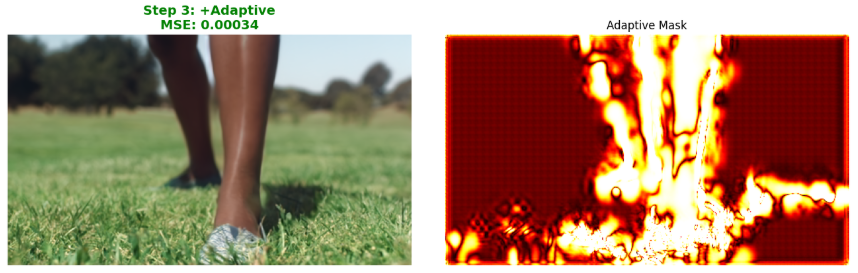
</p>

Full training code on the **_TrainScriptss_** directory as `TrainAdaptiveNET.ipynb`.

The weights of every self trained network can be found [HERE](https://www.kaggle.com/datasets/lucabrunetti2/flowbranch)

# 3.2 Joint training

During the joint training phase, all components of the architecture are fine-tuned together (minimizing the Rate Distortion on the reconstructed frame) so they can learn to interact as a coherent system. In this stage, the main challenges were:

- the small batch size imposed by the Septuplets dataset
- the computational cost of RAFT
- limited time and hardware resources. Training each individual component required more than 100 hours.

The experiments were carried out on an RTX 5090 with 32 GB of VRAM, which was just sufficient to handle the full pipeline. The primary limitation was not model capacity, but the lack of time and resources to extensively explore different configurations (e.g., variable $\lambda$ schedules) or to train on larger raw video datasets such as the [xiph.Org Dwarf Test Media](https://media.xiph.org/video/derf/).

For this reason, we opted for the simplest and most stable configuration during joint training.

Train lasted for 18 epoches for about 32 hours (Full Septuplets Dataset, in the other training we used an half).

The full training code can be found in the **_TrinScriptss_** directory as `JointTrainRTX5090.ipynb`

The final model weights can be found [HERE](https://www.kaggle.com/datasets/lucabrunetti2/codecjtrainweigths)


# 4 Tests and Results

First lets run our codec on two frames to see its behavior. Given $$t-1$$ we need to reconstruct the frame $$t$$; we can see that the the girl pictured moves both arms and the right leg:

<p align="center">
  <table>
    <tr>
      <td align="center" width="45%">
        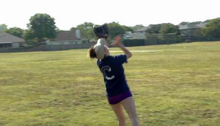
      </td>
      <td align="center" width="45%">
        
      </td>
    </tr>
  </table>
</p>

### Step 1: Compute the flow and Compress it with the **_MotionVAE_**. The results:

<p align="center">
  <table>
    <tr>
      <td align="center" width="45%">
        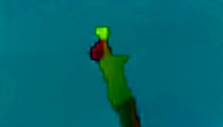
      </td>
      <td align="center" width="45%">
        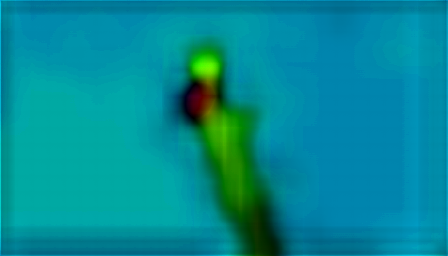
      </td>
    </tr>
  </table>
</p>

<p align="center">

| MSE (flow_norm vs flow_vae) | Motion rate (bpp) |
|:---------------------------:|:-----------------:|
|          0.001941           |       0.0230      |

</p>

Clearly the main error is on the border but the compression is enormous! 

### Step 2: Post processing the decompressed flow with his refinement NET:

In the left: the postprocessed flow; In the right: the warped frame based on the postprocessed flow

<p align="center">
  <table>
    <tr>
      <td align="center" width="45%">
        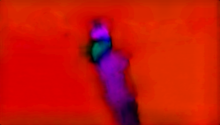
      </td>
      <td align="center" width="45%">
        
      </td>
    </tr>
  </table>
</p>

The post processing enhances the girl's area, in the warped frame the main problem is around the Golf Glove.

<p align="center">

| PSNR (warped vs GT) | SSIM (warped vs GT) |
|:--------------------:|:--------------------:|
|      26.845 dB      |        0.8327        |

</p>

The results speaks clear: the warped frame is still far away from a good quality! So the residual is needed.

### Step 3: Compute and compress/decompress the residual error:

<p align="center">
  <table>
    <tr>
      <td align="center" width="45%">
        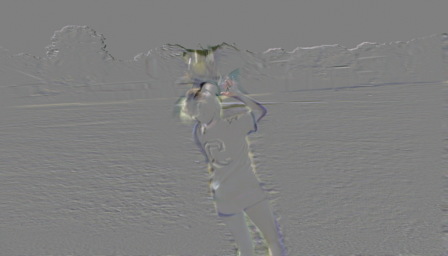
      </td>
      <td align="center" width="45%">
        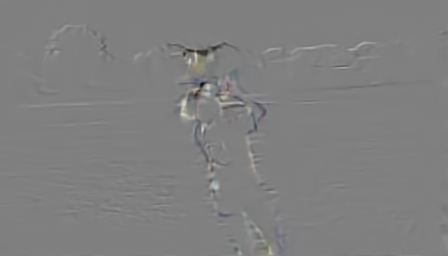
      </td>
    </tr>
  </table>
</p>

<p align="center">

| MSE (residual_gt vs residual_vae) | Residual rate (bpp) |
|:---------------------------------:|:-------------------:|
|             0.000650              |        0.1082       |

</p>

The residual reconstruction is visually very good. In the other hand, becouse the warped frame wasn't a good reconstruction (26dB), the error weights way more than the flow.

### Step 4: Post processing the residual and constructiong our first prediction:

<p align="center">
  <table>
    <tr>
      <td align="center" width="45%">
        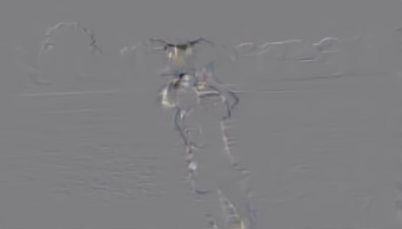
      </td>
      <td align="center" width="45%">
        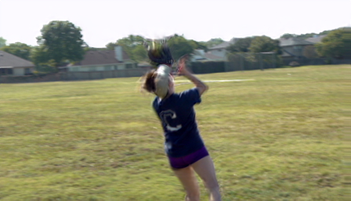
      </td>
    </tr>
  </table>
</p>

<p align="center">

| PSNR (intermediate vs GT) | SSIM (intermediate vs GT) |
|:--------------------------:|:--------------------------:|
|        31.176 dB          |          0.8778           |

</p>

Results speaks clear: with the residual the reconstruction quality is significally enhanced!

### Step 5: Correcting the ghosting and occlusions errors with the occlusion mask:

In the Left: the adaptive mask computed; In the right: final reconstruction after the AdaptiveNET.

<p align="center">
  <table>
    <tr>
      <td align="center" width="45%">
        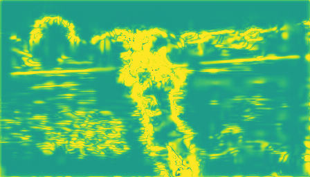
      </td>
      <td align="center" width="45%">
        
      </td>
    </tr>
  </table>
</p>

<p align="center">

| PSNR (final vs GT) | SSIM (final vs GT) | Total rate (bpp) |
|:-------------------:|:------------------:|:-----------------:|
|      35.056 dB     |       0.9388       |      0.1312       |

</p>

The final quality (35.056 dB at 0.1312 bpp) highlights the impact of using the previous 4 reconstructed frames together with the adaptive mask.  
The temporal buffer provides memory of the scene, allowing the network to recover textures and details lost due to occlusions and motion boundaries.  
The adaptive mask guides the refinement to focus on regions where warping is unreliable and residual energy is high.  

So at the end we obtained a very good quality reconstruction with a 100x compression!! 

---

But now we can ask ourself: *why do we need to build a Motion-Residual based codec if we can just compress the images by ouserself?*
Lets make some comparison between our coded and some of the SOTA level image compressor:

### CompressAI's 2018 SOTA VAE

we using `bmshj2018_hyperprior(quality=5, pretrained=True)`, this model got the same base architecture of our VAEs and was SOTA in 2018. The model with quality 5 is the one with the better quality on CompressAI.

<p align="center">
  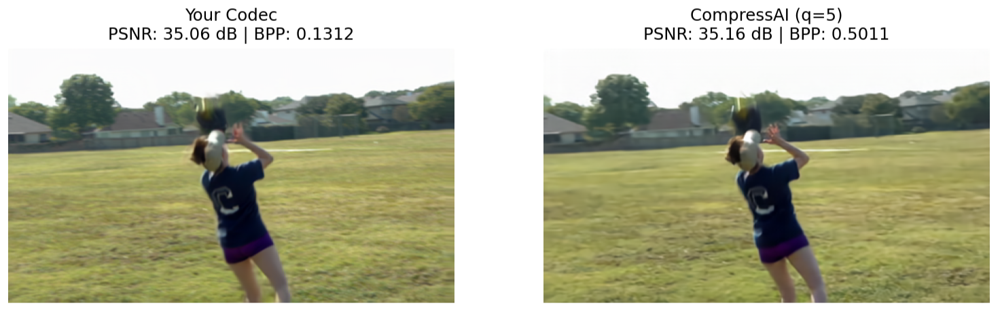
</p>

Test summary on multiple frames reconstruction:

<p align="center">

| Method              | PSNR (dB)            | SSIM              | BPP                  |
|:-------------------:|:--------------------:|:-----------------:|:--------------------:|
| Our Codec     | 33.5992 ± 0.7844     | 0.9231 ± 0.0131   | 0.1518 ± 0.0159      |
| CAi bmshj2018 | 33.7637 ± 0.6643     | 0.9289 ± 0.0276   | 0.6003 ± 0.0907      |

</p>


We obtain the same quality with a 4x rate compression.

### Current SOTA image compressor: **cheng2020_attn** (attention + autoregressive + hyperprior)

The model we are now using [reference](https://arxiv.org/abs/2001.01568). Still on the best reconstruction quality: `cheng2020_attn(quality=5, pretrained=True)`

<p align="center">
  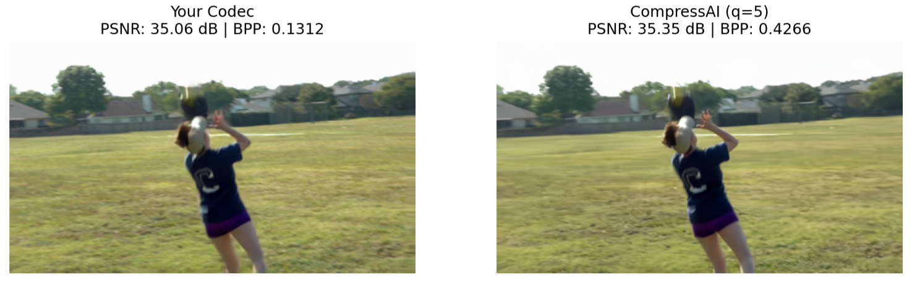
</p>


The full test summary multiple frames:

<p align="center">

| Method              | PSNR (dB)            | SSIM              | BPP                  |
|:-------------------:|:--------------------:|:-----------------:|:--------------------:|
| Our Codec     | 33.5992 ± 0.7844     | 0.9231 ± 0.0131   | 0.1518 ± 0.0159      |
| cheng2020     | 34.2843 ± 0.9603     | 0.9366 ± 0.0102   | 0.4107 ± 0.0362      |

Even againts the SOTA image compressor model, our codec is able to get more then a 2x compression rate! **That proves the strongness of the Motion-Residual compression approach!**

</p>

---

## DVG comparison

Now lets compare our results against DVC on the Vimeo's testset and the [Ultra Video Group dataset](https://ultravideo.fi/dataset.html). This last one is a widely used 1080x720 raw video set, only made to test codecs. 

**_NOTE_**: In order to start processing a video sequence, the 4-frame history buffer must be initialized. To do so, we use the `cheng2020` image compression model provided by CompressAI to encode the first four frames.

This follows the classical **I-frame / P-frame** paradigm used in traditional video codecs:

- **I-frames (Intra frames)** are encoded independently, without relying on any previous frame. They provide a reliable starting point for the decoding process and populate the history buffer.
- **P-frames (Predicted frames)** are instead reconstructed using motion estimation, warping, residuals, and the refinement networks, relying on the previously reconstructed frames stored in the buffer.

In our codec, the first four frames act as I-frames to initialize the temporal context. All subsequent frames are treated as P-frames and reconstructed using the full motion–residual pipeline. As mentioned before, each frame is reconstructed starting from previously reconstructed frames. This means that small reconstruction errors can accumulate over time and progressively degrade the visual quality.

To prevent error propagation, we periodically insert a new I-frame every 30 frames. This effectively resets the reconstruction quality by providing a fresh, independently compressed reference frame, from which subsequent P-frames can be predicted more accurately.

This strategy limits drift over long sequences while maintaining the benefits of motion-based compression for most of the video.

First lets compare the number of parameters:

## 🔢 Model Parameter Count

| Model                          | Total Parameters |
|--------------------------------|------------------:|
| Motion VAE (MVAE)             | 10,135,298 |
| Motion Refinement Network     |    602,755 |
| Residual VAE (RVAE)           |  4,518,659 |
| Residual Refinement Network   |    448,195 |
| Adaptive Refinement Network   |    825,155 |
| RAFT Small (Optical Flow)     |    990,162 |
| **TOTAL**         | **17,520,224** |

While the [DVC official implementation](https://github.com/GuoLusjtu/DVC/tree/master/TestDemo/VideoCodec) has around 24M parameters.


## UVG dataset test

We used the public dataset available on kaggle that contains a majority of the set ([here](https://www.kaggle.com/datasets/minhngt02/uvg-yuv)). Evaluated on all of them, those are the results:

<p align="center">
  <table>
    <tr>
      <td align="center" width="45%">
        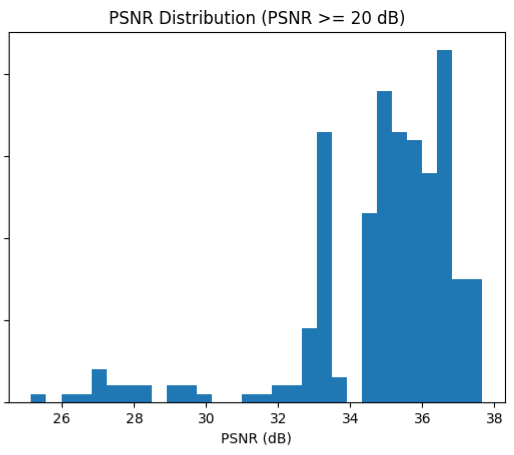
      </td>
      <td align="center" width="45%">
        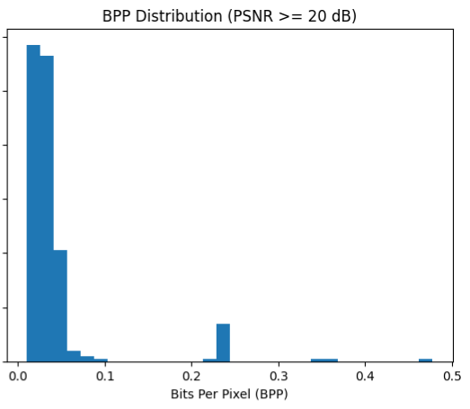
      </td>
    </tr>
  </table>
</p>

*NOTE:* The values that relys after 0.1 on the bpp graph are the I-Frames.

| Metric        | Our Codec        | DVC            |
|---------------|------------------|----------------|
| Avg BPP       | ≈ 0.043          | ≈ 0.05        |
| Avg PSNR      | ≈ 34.9 dB        | ≈ 34.2 dB     |
| SSIM          | ≈ 0.95           | ≈ 0.94        |

These results show that our codec achieves higher reconstruction quality (+ 0.7 dB) while using fewer bits compared to DVC.
Despite operating at a lower average bitrate, it produces a higher PSNR and better SSIM, indicating a more efficient use of the latent information.
This highlights the effectiveness of the refinement networks and the temporal context, which significantly reduce the residual error and improve compression efficiency beyond the original DVC architecture.

## Vimeo90k Test Set.

## References

[1] G. Lu, W. Ouyang, D. Xu, X. Zhang, C. Cai, Z. Gao. **"DVC: An End-to-End Deep Video Compression Framework."** *Proceedings of the IEEE/CVF Conference on Computer Vision and Pattern Recognition (CVPR)*, 2019.

[2] J. Lin, D. Liu, H. Li, and F. Wu, **"M-LVC: Multiple Frames Prediction for Learned Video Compression,"** *Proceedings of the IEEE/CVF Conference on Computer Vision and Pattern Recognition (CVPR)*, 2020.

[3] J. Ballé, D. Minnen, S. Singh, S. J. Hwang, and N. Johnston, **"Variational Image Compression with a Scale Hyperprior,"** *International Conference on Learning Representations (ICLR)*, 2018. 

[4] Z. Teed and J. Deng, **"RAFT: Recurrent All-Pairs Field Transforms for Optical Flow,"** *ECCV*, 2020.
